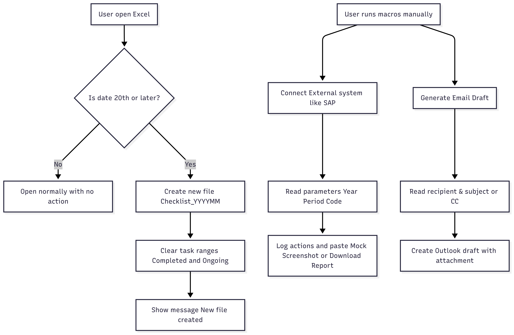

# Excel VBA Automation — Public Showcase (Demo)

> This repository showcases three Excel VBA automations using only fake data, mock flows, and simplified code skeletons.  
> It is designed for portfolio purposes and contains no company information.

What’s included
  - Monthly checklist backup (demo)
  - Mock flow for external system screen-capture (no real system calls)
  - Outlook email draft automation
What’s not included
  - No company names, codes, servers, or proprietary logic
  - No real data, no credentials, no integration secrets

Features

1. Monthly Checklist Backup (Demo
   - Creates a month-tagged copy (e.g., `Checklist_202501.xlsm`) in the same folder
   - Clears predefined input ranges for the new month
   - Safe, local-only behavior

2. External System Flow (Mock)
   - Simulates opening a transaction/report, waiting for user input, and “pasting” a screenshot
   - No actual system dependency (works on any machine)
   - Logs actions to a sheet as traceable steps

3. Outlook Email Draft
   - Drafts an email using values from a sheet (subject/to)
   - Attaches the current workbook
   - Uses `.Display` only (never `.Send` by default)

Process Diagram

> Conceptual only; no vendor-specific details.

1. Rendered Diagram (PNG)

This image was exported from Mermaid and shows the overall process clearly:


2. Mermaid Source Code (for reference)

For transparency, here is the Mermaid code that generated the diagram above.  
Anyone can copy this block into [Mermaid Live Editor](https://mermaid.live) to reproduce the diagram.

```mermaid
flowchart TD
  A[User open Excel ] --> B{Is date 20th or later?}
  B -->|No| C[Open normally with no action]
  B -->|Yes| D[Create new file Checklist_YYYYMM]
  D --> E[Clear task ranges Completed and Ongoing]
  E --> F[Show message New file created]

  %% Separator
  X[User runs macros manually] --> G[Connect External system like SAP ]
  G --> H[Read parameters Year Period Code]
  H --> I[Log actions and paste Mock Screenshot or Download Report]

  X --> J[Generate Email Draft]
  J --> K[Read recipient & subject or CC]
  K --> L[Create Outlook draft with attachment]

